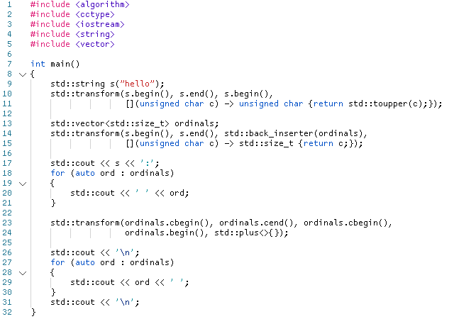
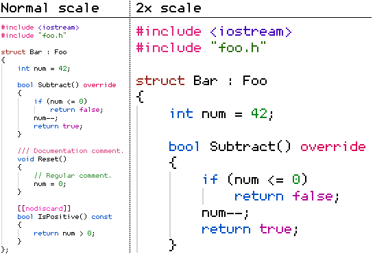

A collection of bitmap programming fonts I've made for myself over the years.

## Monocat 7x14

7x14 refers to the recommended font size in pixels. Turn off antialiasing for best results.

## Monocat 6x12

The goal was to create the tiniest readable programming font.

6x12 refers to the recommended font size in pixels. Turn off antialiasing for best results.

### Supported characters

ASCII (aka `Basic Latin` in Unicode), Cyrillic characters.
