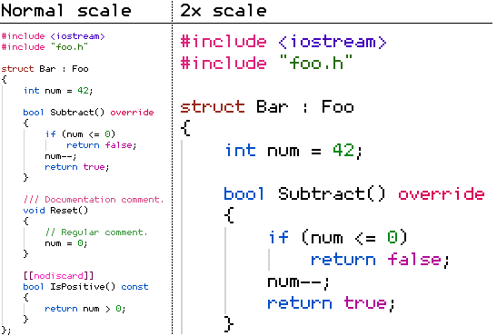

## Monocat 6x12

The goal was to create the tiniest readable programming font.

`6x12` in the name refers to the font size in pixels. I couldn't make it smaller without harming readability.

For best results, the font size should be set to a multiple of 12.

It's intended to be used without antialiasing (especially if not upscaled), but it *does* work with antialiasing.

Demo, without antialiasing:

### Supported characters

ASCII (aka `Basic Latin` in Unicode), Cyrillic characters.
